# Kharch Tracker

A modern personal finance companion app built with Flutter. Kharch Tracker helps you monitor your transactions, set and achieve savings goals, and gain insights into your spending habits through clear, interactive charts.

## Features

- **Dashboard:** Get a quick overview of your total balance, overall income, expenses, and weekly spending breakdown.
- **Transactions Management:** Easily view, search, and filter your daily transactions (Income vs. Expense). 
- **Goal Tracking:** Set savings goals, track your progress with beautiful circular indicators, and maintain savings streaks.
- **Deep Insights:** Detailed analytics including category-wise spending pie charts and monthly trends to understand your financial health.
- **Security:** Biometric authentication ensures your sensitive financial data remains private.
- **Data Export:** Export your transaction data securely to CSV format.

## Screenshots

### Home

  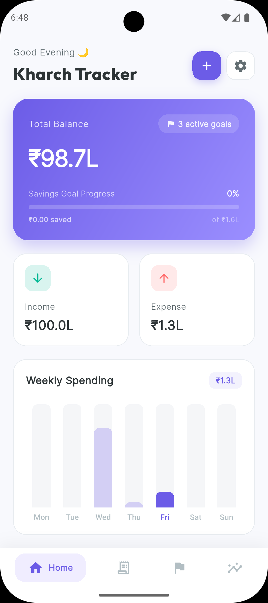
  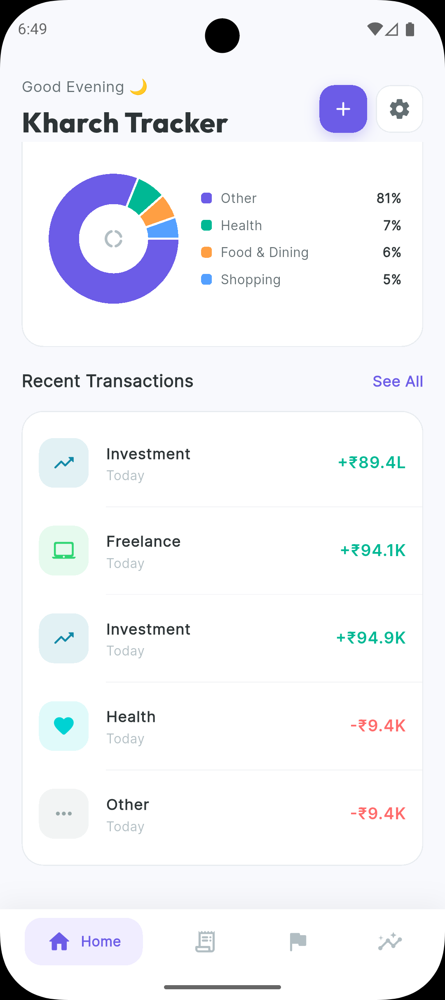
  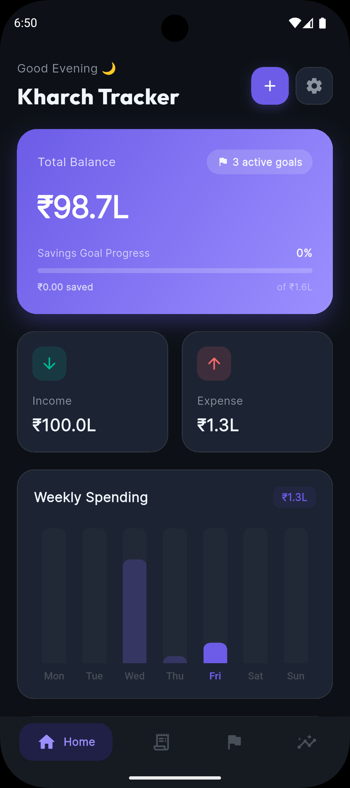

### Transactions

  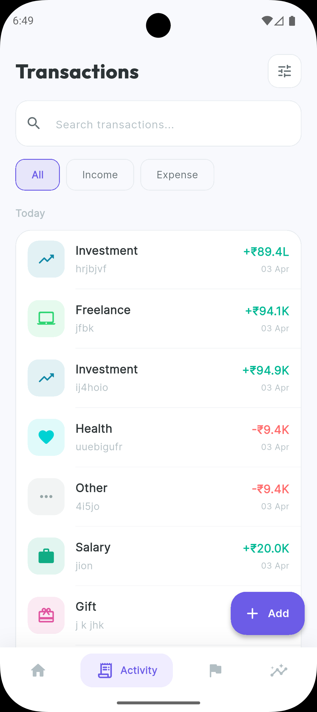
  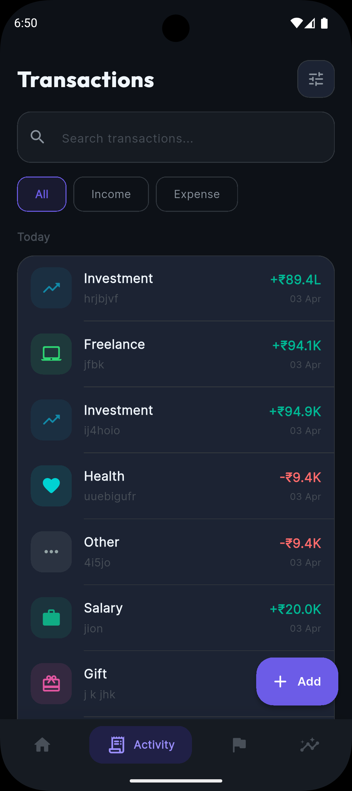
  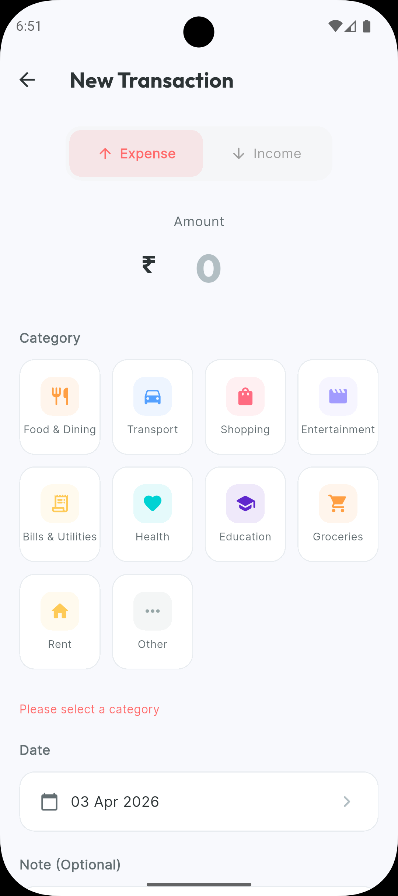

### Goals

  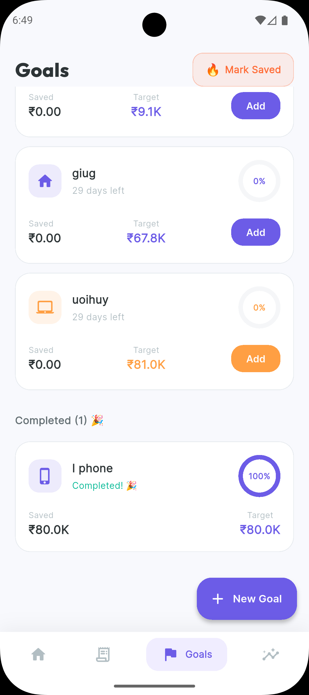
  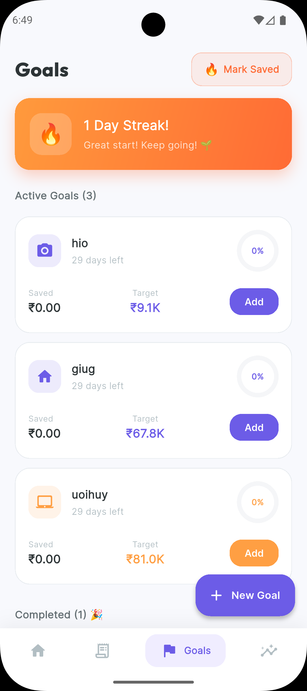
  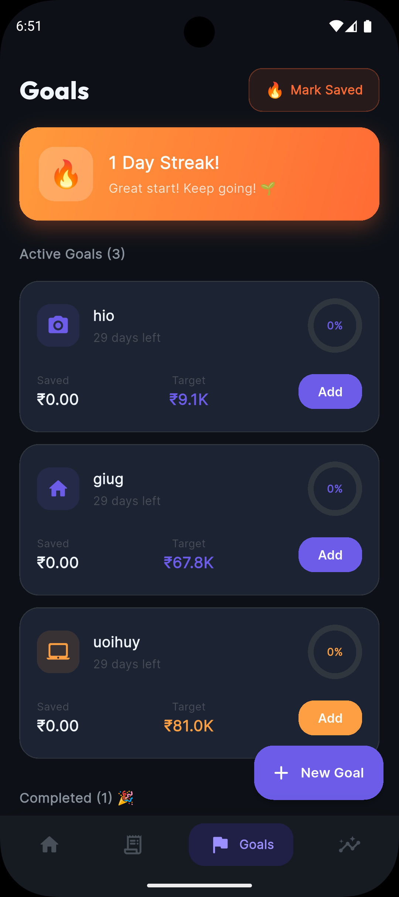
  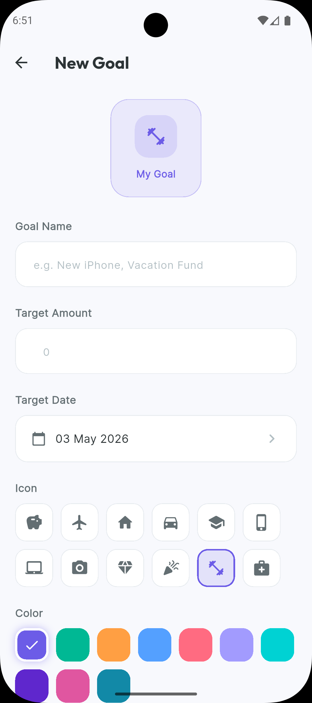

### Insights

  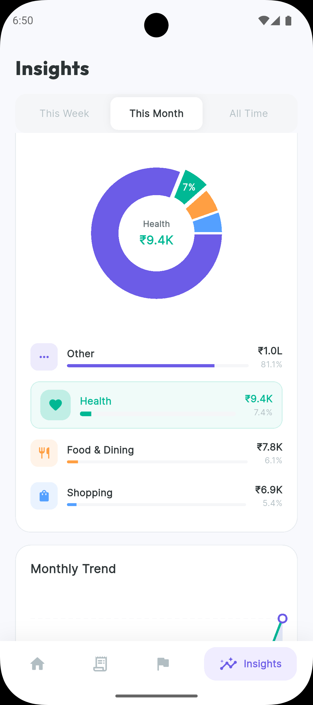
  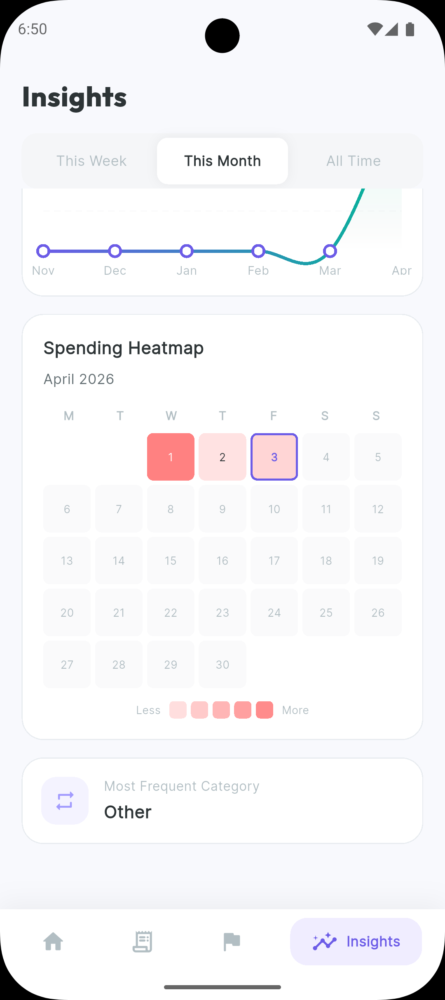
  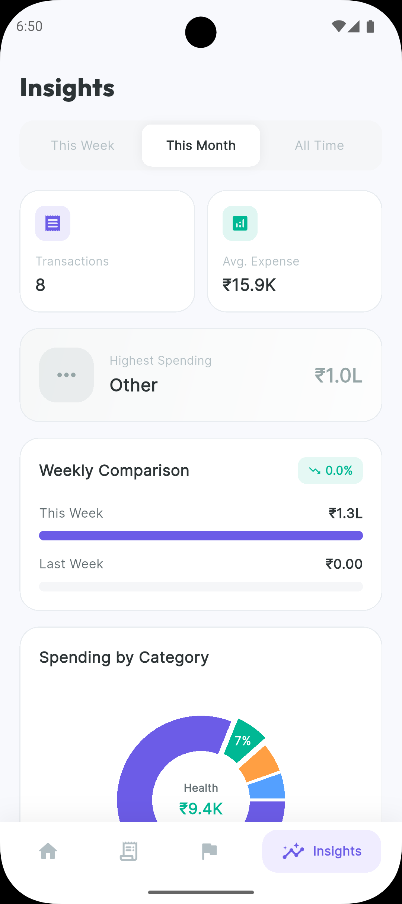
  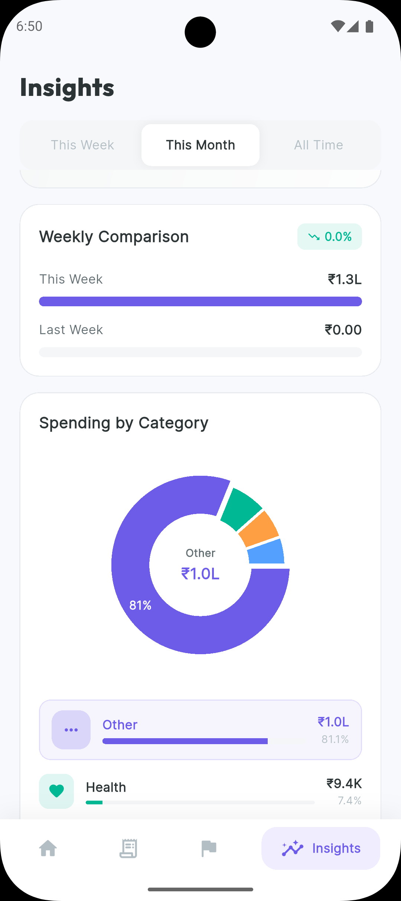
  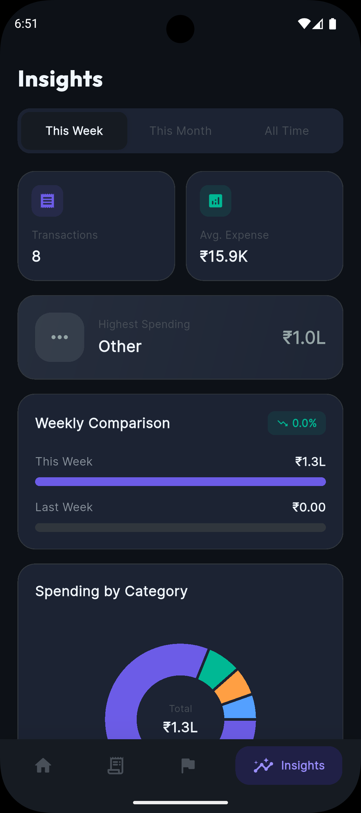

### Settings

  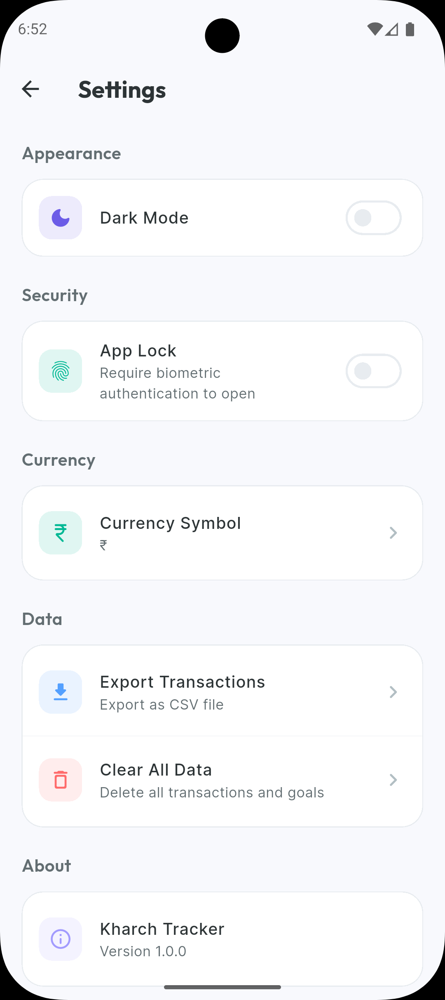
  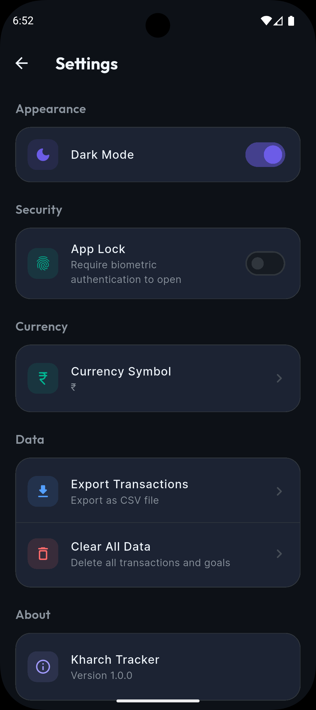

## Technologies & Architecture

- **Framework:** Flutter
- **State Management:** BLoC (`flutter_bloc`)
- **Navigation:** `go_router`
- **Database:** `sqflite` (Local SQLite database)
- **UI/Charts:** `fl_chart`, `google_fonts`, `flutter_animate`, and `shimmer` for a premium user experience
- **Native Utilities:** `local_auth` for security, `share_plus` and `csv` for data export
